# TrueWeather - Hackathon Group 3

## Table of Contents

- [Introduction](#introduction)
  - [What "TrueWeather" Is](#what-trueweather-is)
  - [Standout Features](#standout-features)
  - ["The AI Bit"; how we used AI in this project](#the-ai-bit-how-we-used-ai-in-this-project)
  - [Copyright / DMCA Compliance](#copyright--dmca-compliance)
  - [Leftovers / Cut Features / Other TODOs / Tech Debt](#leftovers--cut-features--other-todos--tech-debt)
- [How we Worked as a Team](#how-we-worked-as-a-team)
  - [Monday - Project Kickoff and Initial Setup](#monday---project-kickoff-and-initial-setup)
  - [Tuesday - User Stories, Designs and Wireframes](#tuesday---user-stories-designs-and-wireframes)
  - [Wednesday - Code Crunch](#wednesday---code-crunch)
  - [Thursday - Final Touches, Deployment, Validation and Documentation](#thursday---final-touches-deployment-validation-and-documentation)
- [Branch Structure](#branch-structure)
- [Beyond the MVP](#beyond-the-mvp)
- [Site Screenshots](#site-screenshots)
  - [Mobile Home Page (Simulated on an iPhone 12 Pro)](#mobile-home-page-simulated-on-an-iphone-12-pro)
  - [iPad / Tablet Home Page (Simulated on an iPad Mini)](#ipad--tablet-home-page-simulated-on-an-ipad-mini)
  - [Desktop Home Page](#desktop-home-page)
- [UX / UI Design](#ux--ui-design)
  - [Fonts and Typography](#fonts-and-typography)
  - [Color Palette](#color-palette)
  - [Branding](#branding)
  - [Wireframes](#wireframes)
    - [Lewis' Wireframes](#lewis-wireframes)
    - [Jonnie's Wireframes](#jonnies-wireframes)
    - [Veena's Wireframes](#veenas-wireframes)
- [User Stories](#user-stories)
- [Testing and Validation](#testing-and-validation)
  - [HTML Validator](#html-validator)
  - [CSS Validator](#css-validator)
  - [AutoPrefixer Usage](#autoprefixer-usage)
  - [Lighthouse Audits](#lighthouse-audits)

## Introduction

### What "TrueWeather" Is

A static, fully responsive website built with a focus on accessibility, clean design, and user-friendly navigation.

Page-by-page, the site includes:

- **Home Page / Search Page**: A page that allows you to search for weather information by city name or by using your current location taken from your browser. When viewing a location, you can see current weather conditions, a 5-day forecast, air quality index (AQI), sunrise and sunset times, and other relevant weather data. You can also save locations to your "Saved Locations" page for quick access later on.
- **Saved Locations Page**: A page that displays all of your saved locations, allowing you to quickly switch between them to view their current weather conditions. You can also remove locations from this page if you no longer wish to keep them.

### Standout Features

- **Bootstrap 5**: Utilizes the latest version of Bootstrap for a modern, responsive layout.
- **Responsive**: Optimized for all devices, ensuring usability on desktops, tablets, and smartphones.
- **Framework / Component-ready**: Modular HTML structure with clear class names for easy updates and maintenance. Can easily be integrated into frameworks like React or Vue.

### "The AI Bit"; how we used AI in this project

The use of generative AI played a key role in the development of this project. AI allowed us to stay efficient and keep working to deliver maximum output on the short deadline that this assignment had:

- **Layout and Scaffolding**: When dealing with complex layouts (e.g. the mental health info panels), we asked Copilot to generate the rough grid structure in HTML and Bootstrap classes. These often had small styling issues, so a full understanding of Bootstrap and HTML was required from us in order to tweak the styles to exactly how we wanted them.
- **Codebase-wide Validation**: When we were nearing the completion of our MVP, we asked Copilot to scan our entire codebase for any common mistakes, like incorrect semantics of HTML elements, and inconsistent / redundant CSS classes. Copilot provided us with a list of potential issues, and offered to fix them for us. We applied and tested each change one at a time to ensure nothing broke, and never let it add any HTML or CSS that we didn't fully understand.
- **Codebase-wide Repetitive Tasks**: When we had created all of the individual pages and content for the site, we needed to ensure all of our navigation links were correct across every page. We used Copilot to scan our codebase and update all of the `<nav>` and `<a>` elements to ensure that the everything clickable led to the right area. This saved a huge amount of time compared to manually correcting **EVERY** nav link in **EVERY** navbar in **EVERY** file.
- **Documentation Clarity**: We used ChatGPT to help us proofread and clarify sections of this README file, ensuring that our explanations made sense. We also used it to generate the contents page at the top of this README!

### Copyright / DMCA Compliance

- **Images**: All icons used in this project are sourced from [Font Awesome](https://fontawesome.com/) and are licensed under the Creative Commons Attribution 4.0 International license. The weather icons themselves come from OpenWeatherMap's [Weather Icons](https://openweathermap.org/weather-conditions) set, which are free to use with attribution.

### Leftovers / Cut Features / Other TODOs / Tech Debt

- **Map Integration**: Initially, we wanted to integrate a map feature using the [MapBox](https://www.mapbox.com/) library to allow users to visually select locations, and visually display the conditions on a map. However, due to time constraints, this feature was not implemented in the final version.
- **Consolidation of API Functions / Deprecating the "Search By City" function**: When building the foundation code for the site, we created two separate functions to fetch weather data: one for searching by city name, and another for searching by geographic coordinates (latitude and longitude). However, after further consideration, we realized that the "Search By City" function was deprecated by the OpenWeatherMap API in favor of using geographic coordinates. If we wanted to search by city, we should use their Geocoding API to convert city names into coordinates, and then use those coordinates to fetch the weather data. This consolidation would streamline our codebase and enforce DRY coding principles. Due to time constraints, we were unable to implement this change before the project deadline.
- **Repo-wide JSDoc Documentation**: Inside our `saved-locations.js` file, we use JSDoc comments to document our functions and variables. However, we did not have time to implement this documentation style across the entire codebase. This is something we would like to address in future iterations of the project to improve code maintainability and clarity.

A live version of the site can be accessed [via GitHub Pages](https://lewis1190.github.io/weather-app-hackathon-team-3/).

## How we Worked as a Team

This project was completed as part of a team of four during a 3.5 day hackathon. The team was made up of Lewis, Veena, Eldad and Jonnie. We used GitHub Projects to manage our tasks and track progress. Each team member was assigned specific user stories to work on, and we held regular check-ins to discuss our progress and any challenges we faced.

This section will detail a brief overview of how we collaborated effectively to complete the project each day within the tight deadline.

### Monday - Project Kickoff and Initial Setup

- We began by brainstorming ideas for the project, discussing potential features and functionalities we wanted to include in our weather app. We verbally discussed the core features that would form the MVP of our app, as well as any additional features we could implement if time allowed.
- Once we had a clear vision for the project, we set up our GitHub repository and created a project board to manage our tasks.
- We looked into existing weather apps and websites, to get inspiration for our own design and functionality. Notable inspirations include:
  - [The Met Office](https://weather.metoffice.gov.uk/)
  - [AccuWeather](https://www.accuweather.com/en/gb/bristol/bs1-6/weather-forecast/327328)
  - [WeatherWise](https://web.weatherwise.app/#map=19.28/51.5052952/-2.616259)
- We created a collaborative Google Doc to outline rough user stories, acceptance criteria, and tasks. We also discussed other things, such as recommended AI models to use in Copilot to help us speed up development. We also outlined the which Weather API we'd use, and what map library we'd use if we had time to implement it.
- You can view this initial project doc [here](https://docs.google.com/document/d/1AM4e3hyXT1a1WAf62WY3DitrO5X51RS6JH-f4r6yObU/edit?tab=t.0) (view only).
  - Later on in the project, we'd also use this doc to list any tech-debt that we may need to account for at the end of the project.

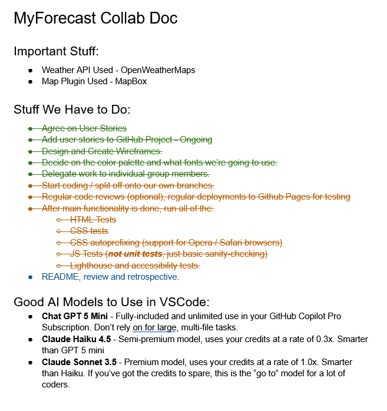
_A screenshot of our collab doc on Google Docs_

As we have active subscriptions to GitHub Copilot, we wanted to see how far the AI could get, if we fed all of our user stories into a single prompt. We gave it everything it needed and let it generate. It produced this:

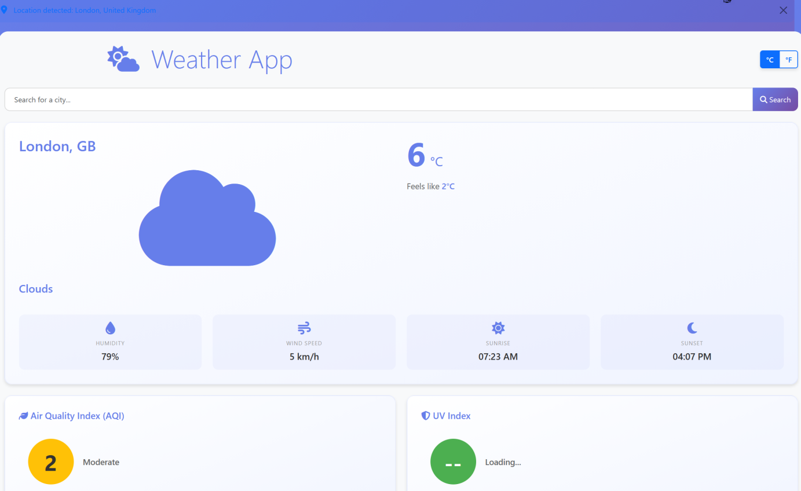

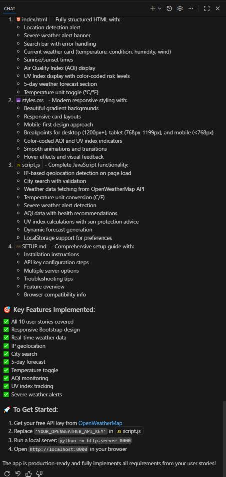

Not great, but far from terrible! Whilst we didn't use much of the code produced in this prompt, it was great to get more visual ideas on how we could structure the site, and what components we could use.

We also used ChatGPT to generate an image of what a weather app site **could** look like, rather than generating code. Again, all of this helped us to brainstorm ideas that we would then implement via the Balsamiq wireframes later on.

### Tuesday - User Stories, Designs and Wireframes

- We created our user stories and acceptance criteria. We started off with simple user stories to make up our MVP, and also asked AI (ChatGPT) to help us brainstorm additional user stories that we could implement if time allowed.
- We created wireframes for the main pages of the site using Balsamiq. Each team member would work on wireframes for the same page. This meant we could have a look and see which team members did things a bit differently, and refine the final design based on the best ideas from each team member.
- We created a sitemap to help us visualize the structure of the site, and how the different pages would link together.
- Towards the end of the day, we finalized the user stories and delegated all of the stories to team members based on their strengths and interests. We divided the work as equally as possible, meaning everyone had the same amount of "must-have", "should-have" and "could-have" stories to work on.

### Wednesday - Code Crunch

- We set up the initial project structure, including the HTML, CSS, and JavaScript files. Veena created the initial Bootstrap layout and navigation structure for the site, as well as the "first draft" of the fetching functions for the OpenWeatherMap API.
- Lewis then worked on trying to simplify the foundation code for fetching weather data, so everything was easily readable and maintainable for the rest of the team.
- Once the foundation was finalized, everybody branched off of the "develop" branch and started working on their assigned user stories. We made sure to commit and push our changes frequently, and created pull requests for each feature or bug fix to allow for code reviews.
- We held regular check-ins throughout the day to discuss our progress, any challenges we faced, and to ensure that we were all on track to meet our deadlines. If anyone was stuck on any of the user stories, we would pair program to help them get past any blockers.

### Thursday - Final Touches, Deployment, Validation and Documentation

- We focused on testing and validating our code to ensure everything was working as expected. We used various tools to validate our HTML, CSS, and JavaScript code, and made any necessary adjustments based on the results.

- We all ran a comprehensive testing session of the site, trying to break it and cause any errors on lots of different devices and browsers. If any bugs were found, we'd fix the issue and merge it back into the `develop` branch.

- When we were happy to "release" the MVP, we merged the `develop` branch into the `main` branch, and deployed the site using GitHub Pages.

## Branch Structure

- `main` - The main branch contains the production-ready code for the website. This branch is protected and only updated through pull requests from the `develop` branch after thorough testing and code reviews.
- `develop` - The develop branch is where all feature development and bug fixes take place. Developers will branch off of develop to work on user stories.
- "named" branches - Veena, Jonnie and Eldad would create a branch based on their first name, and would tackle any user stories assigned to them. Once a feature or bug fix was complete, they'd create a pull request to merge their changes back into the `develop` branch for testing and review. They would continue working on these branches without creating new branches for each user story, to keep things simple and easy to manage.
- "single-purpose" branches - Lewis would create a new branch for each fix or feature he worked on. This would follow the format of `feat/short-description` or `fix/short-description`. This approach allowed for more granular control over each change, making it easier to review and test individual features or fixes before merging them back into the `develop` branch. Once he was finished with a branch, he would delete it. Any further changes would be made in a new branch.

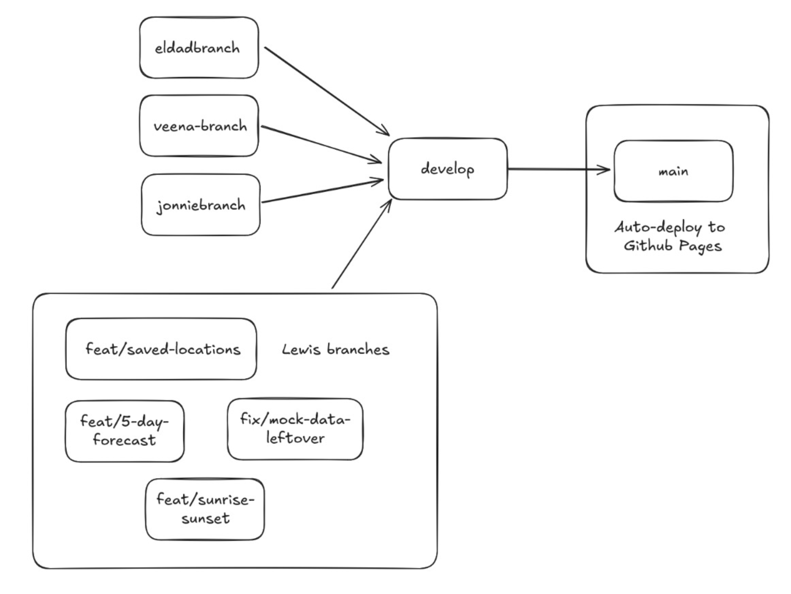
_Our GitHub branch structure_

## Beyond the MVP

As Veena's tasks primarily involved building the core of the site, she was finished with her assigned user stories quite quickly. As she had some time left before the deadline, she decided to work on some additional features that were not part of the original MVP in her own branch, such as the "Heat Map" functionality, and a general design refresh of the site that went beyond what comes out of the box in Bootstrap 5.

Veena's work and report on these additional features can be found in her branch of the repository here: [veena-branch](https://github.com/lewis1190/weather-app-hackathon-team-3/tree/veena-branch)

## Site Screenshots

### Mobile Home Page (Simulated on an iPhone 12 Pro)

Mobile Screenshots (click to expand)

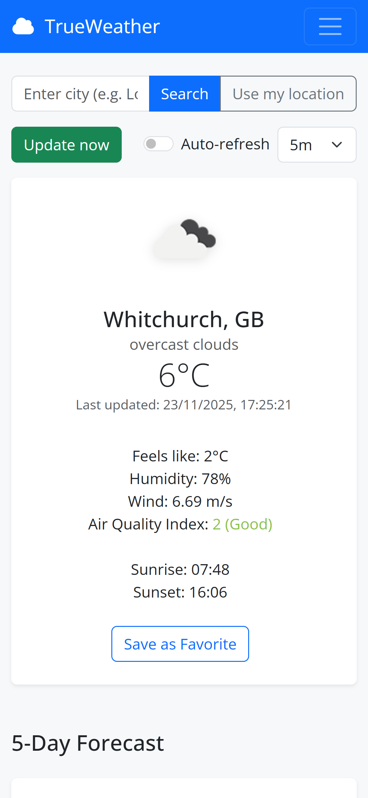

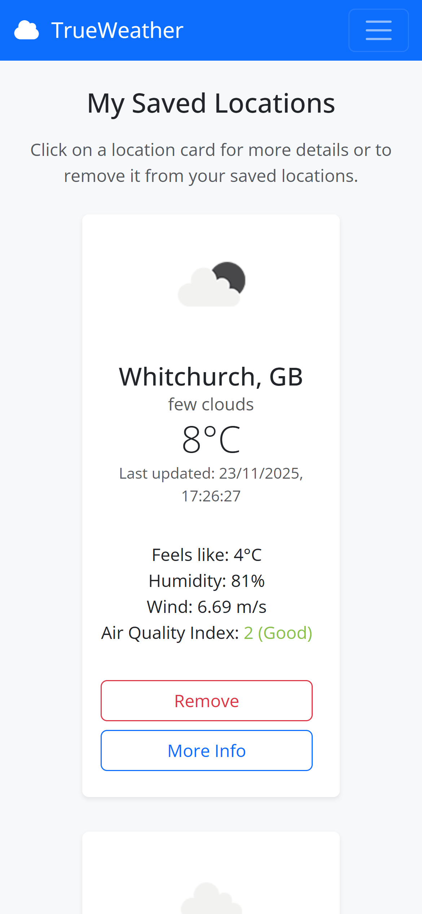

### iPad / Tablet Home Page (Simulated on an iPad Mini)

iPad / Tablet Screenshots (click to expand)

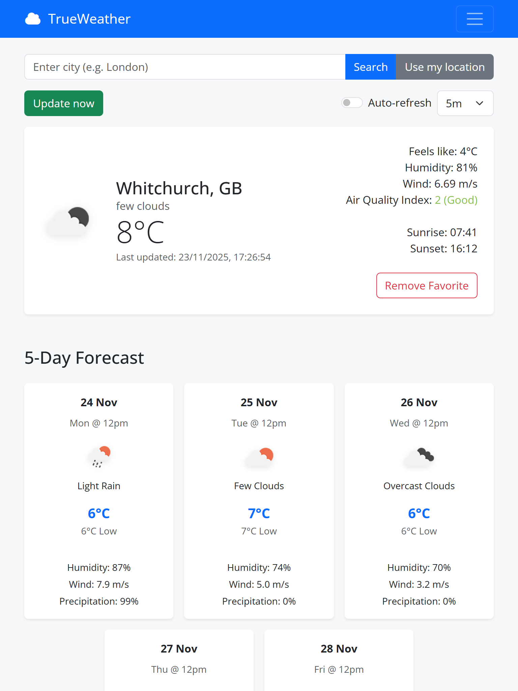

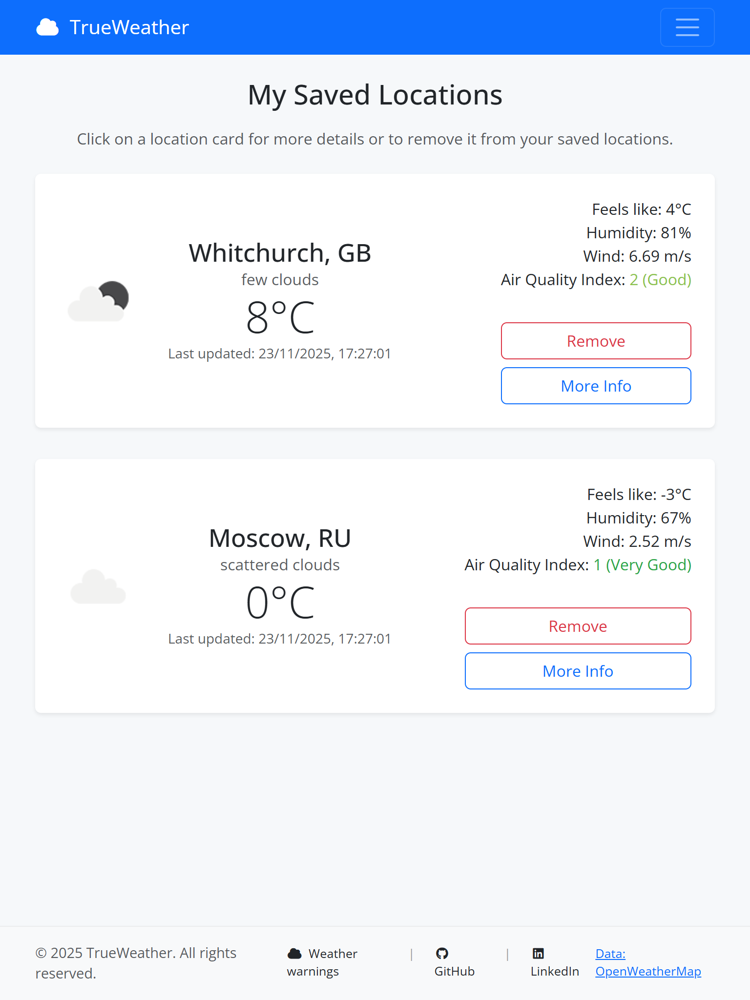

### Desktop Home Page

Desktop Screenshots (click to expand)

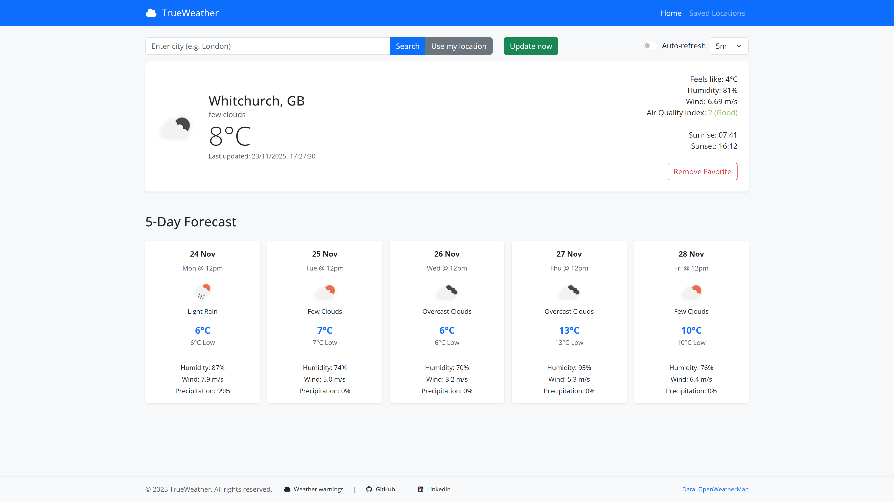

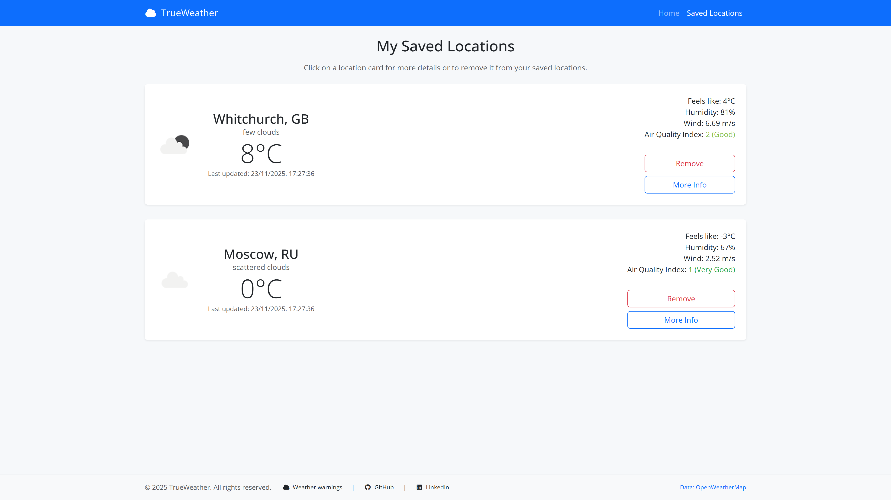

## UX / UI Design

### Fonts and Typography

- [Fontawesome](https://fontawesome.com/) for icons to enhance visual appeal and usability. Used for the social media icons, and the tick in the page after a user submits any contact form.

- [Google Fonts](https://fonts.google.com/) for the fonts; we used the font 'Poppins' for headings and body text. We chose a single font here, as that was our intended branding and design for the site to keep it as clean and accessible as possible.

### Color Palette

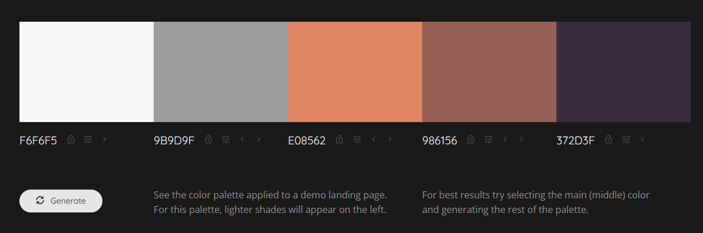

This was our initial choice for the color pallette of the site. We used [Colormind](http://colormind.io/) to help us pick the lighter shades for the colors, for accents and button highlights. Due to time constraints, we were unable to implement this color scheme; instead sticking to the default Bootstrap colors for the MVP.

### Branding

We passed ideas for branding and characters back and forth with ChatGPT to see what it would suggest. Giving us a few visual mockups to work from really helped us decide on the overall look and feel of the site.

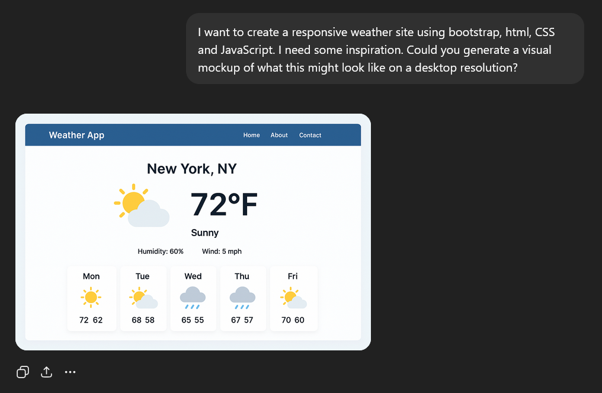

Above is our initial prompt to ChatGPT that helped us decide on the brand for the site. We were really happy with the mockup it gave us, as it allowed us to visualize possible layouts before committing to a specific design.

### Wireframes

We used Balsamiq to create wireframes for the site before starting development. To keep everyone involved in each step of the development process, team members would make wireframes for the same pages of the site, allowing us to compare and contrast our ideas before settling on a final design.

We put together a sitemap to help us visualize the structure of the site, and how the different pages would link together. You can see the the initial sitemap, and how that compares to the MVP.

**NOTE:** Some of these images are quite large, so please right click and open them in a new tab if you're having trouble viewing them in full.

### Lewis' Wireframes

Wireframes here (click to expand)

#### Sitemap

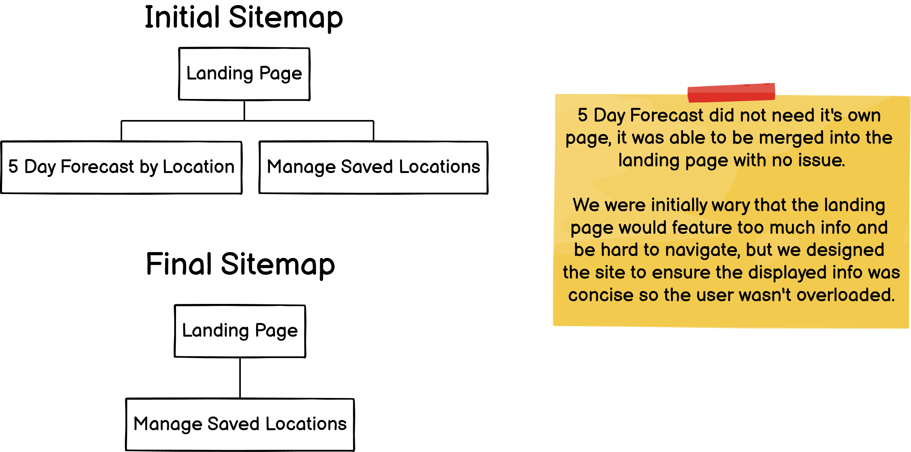

#### Home Page Wireframe

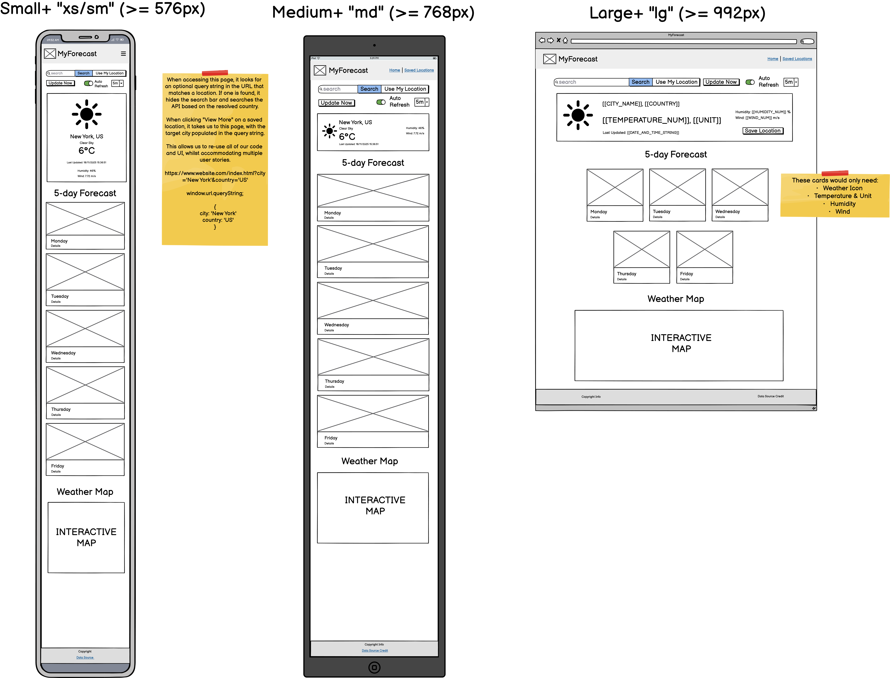

#### About Page Wireframe

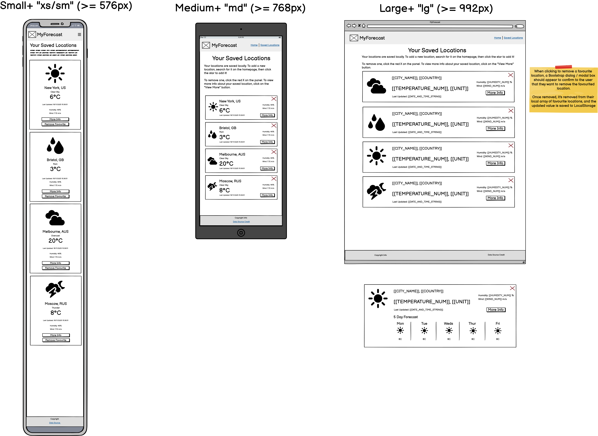

### Jonnie's Wireframes

Wireframes here (click to expand)

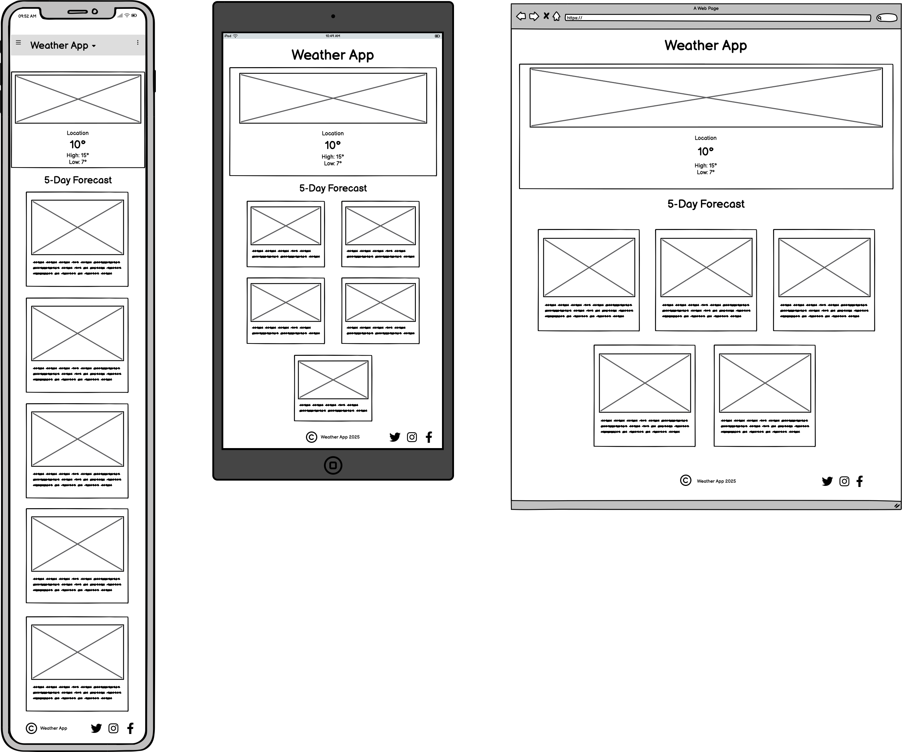

### Veena's Wireframes

Wireframes here (click to expand)

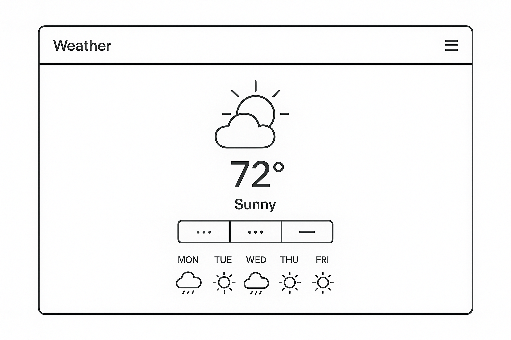

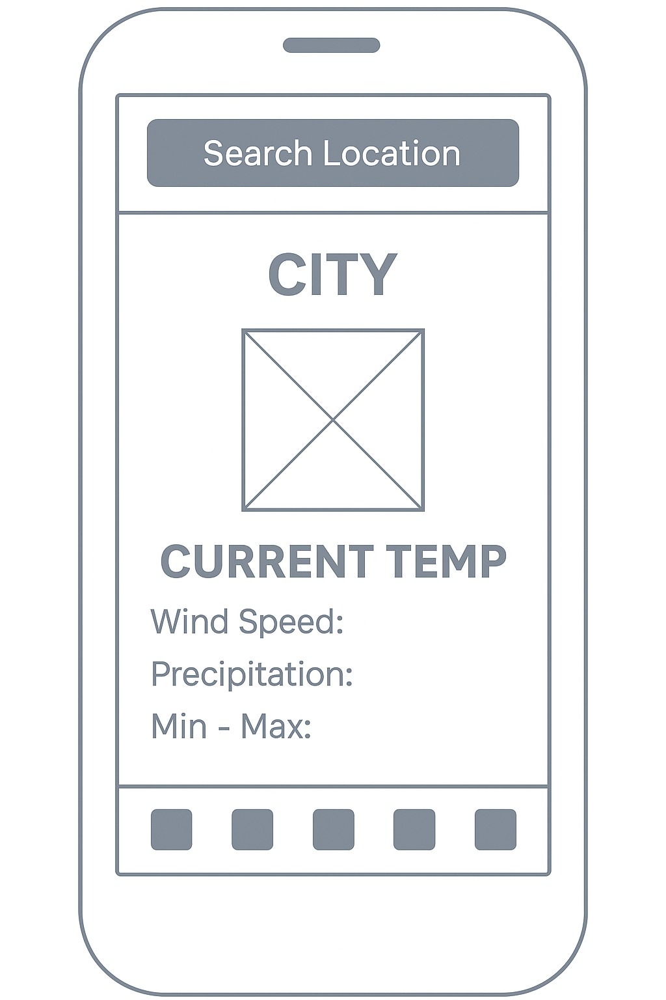

## User Stories

Below are the user stories we used to guide our development of the site. We briefed ChatGPT that we were creating a weather app, and wanted simple search functions, as well as allowing users to save locations for quick access later on.

Below are the top-level user stories only. The full list with acceptance criteria and tasks can be found in the [Github project](https://github.com/users/lewis1190/projects/7/views/1) that we ran for this repo.

- As a user, I want to view the current weather conditions for my location (Using "Current Location") so that I can plan my day accordingly
- As a user, I want to search for the current weather by entering a city name so I can see up-to-date weather information for that city.
- As a user, I would like my selected city to auto-refresh every 1, 5 and 15 minutes
- As a user, I want to see air quality index (AQI) so that I can assess if air is safe to breathe
- As a user, I want to see the "feels like" temperature so that I understand what the weather actually feels like
- As a user, I want clear feedback for invalid or empty city searches so I know what went wrong and how to fix it.
- As a user, I want to see sunrise and sunset times so that I can plan outdoor activities
- As a **_frequent user_**, I want to save favourite cities so I can quickly switch between them without retyping.
- As a user, I want to see a 5-day weather forecast so that I can plan ahead for the week
- As a user, I want clear alerts for network/API/geolocation errors so I understand failures.
- As a **_mobile user_**, I want the UI to be responsive and accessible so the app works on mobile and with assistive tech.
- As a **_travelling user_**, I want my location to be automatically detected via my IP address so that I don't have to manually enter my location on first visit
- As a user, I want to toggle between Celsius and Fahrenheit so that I can view temperature in my preferred unit
- As a user, I want to see weather alerts if severe conditions are expected so that I can prepare for dangerous weather
- As a user, I want a light/dark theme toggle so I can use the app comfortably in different lighting conditions.
- As a user, I want to see UV index information so that I know if I need sun protection

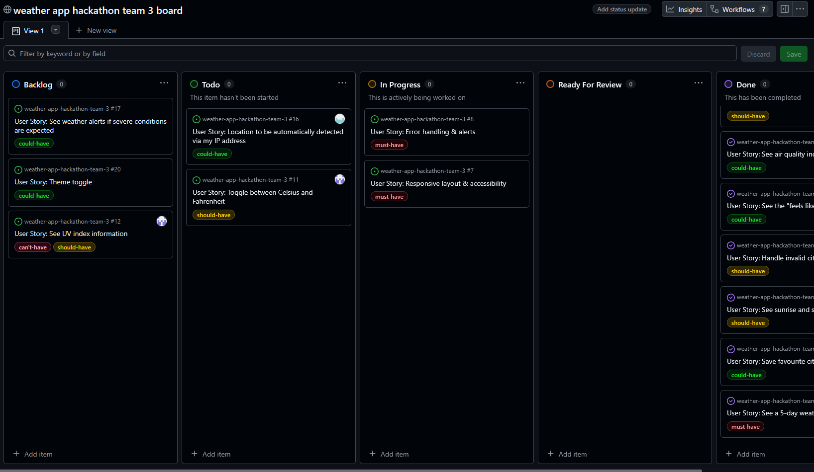

## Testing and Validation

Here are the tools we used to verify and validate our code during development:

- **[HTML Validator](https://validator.w3.org/)**: We used the W3C Markup Validation Service to check our HTML for any syntax errors or issues.
- **[CSS Validator](https://jigsaw.w3.org/css-validator/)**: The W3C CSS Validation Service helped us ensure our stylesheets were error-free and followed best practices.
- **[Autoprefixer for CSS](https://autoprefixer.github.io/)**: We used Autoprefixer to automatically add vendor prefixes to our CSS rules, ensuring better compatibility with different browsers such as Opera and Safari.
- **[Lighthouse for Chrome DevTools](https://developers.google.com/web/tools/lighthouse)**: We used Lighthouse to audit our site for performance, accessibility, and SEO best practices. This was a great way to score our site and identify actionable steps we can take to increase the quality of our site.
- **Physical Device Testing**: We tested the site on multiple physical devices, including an iPhone SE, a 2025 iPad, and a Windows 10 desktop and a OnePlus 6T to ensure consistent performance and appearance across different screen sizes and operating systems.

Below are a collection of screenshots of us using all of the above tools.

### HTML Validator

W3C Validator Screenshots (click to expand)

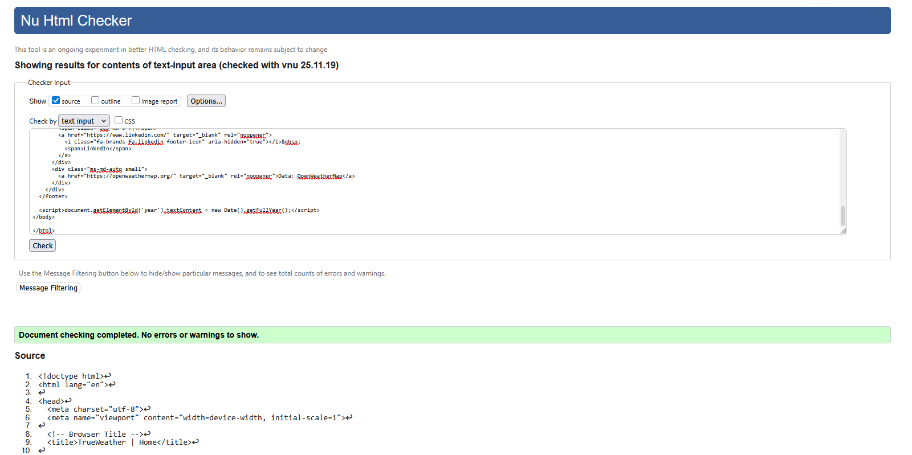

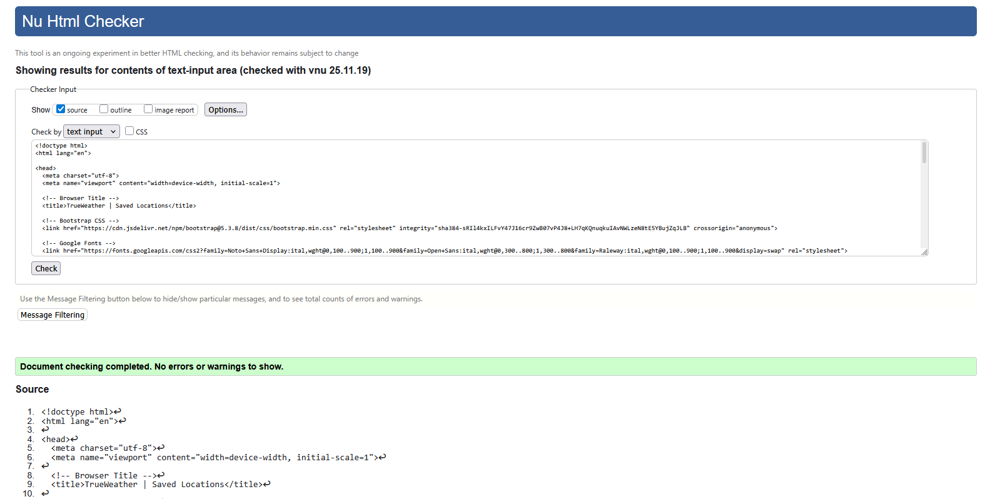

### CSS Validator

CSS Validator Screenshot (click to expand)

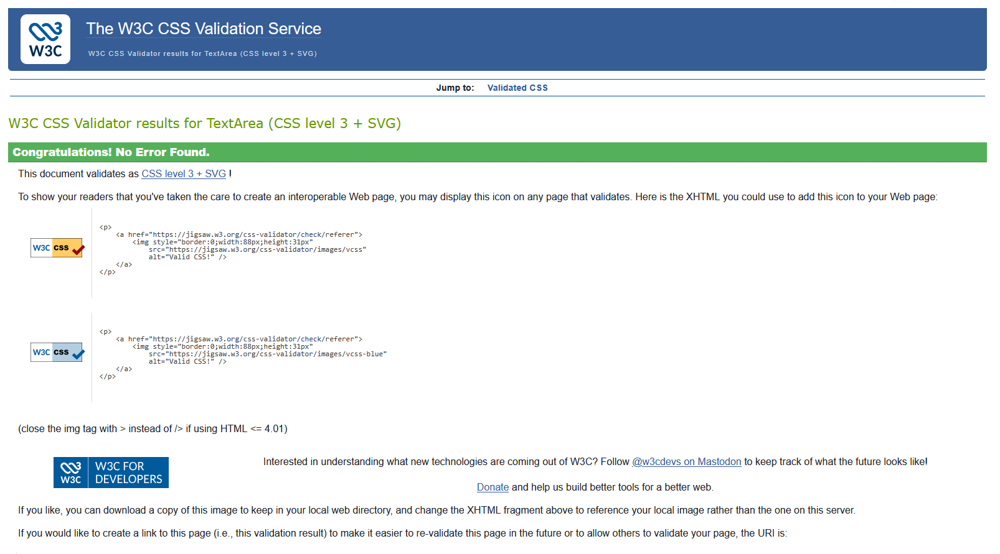

### AutoPrefixer Usage

AutoPrefixer Usage Screenshot (click to expand)

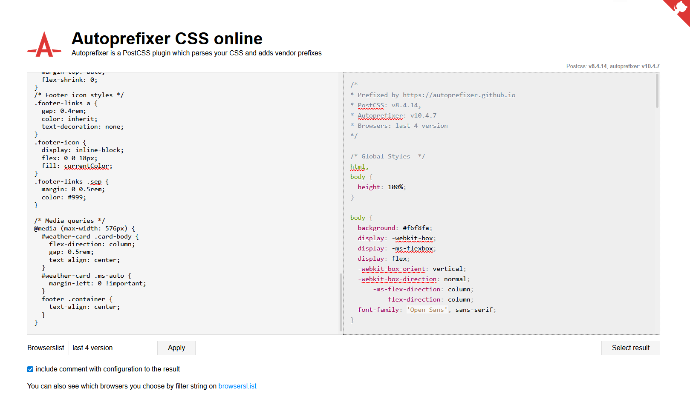

### Lighthouse Audits

Lighthouse Audits Screenshots (click to expand)

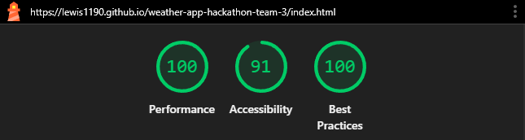

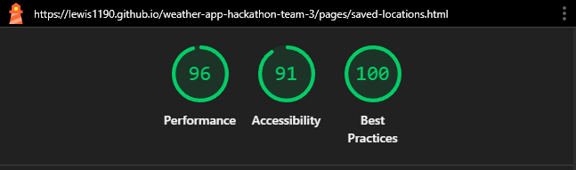

